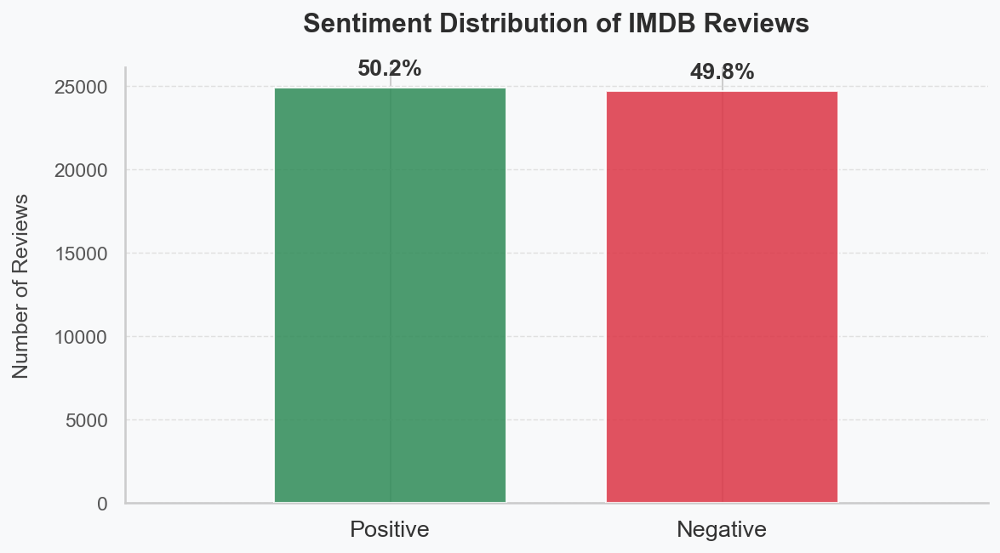
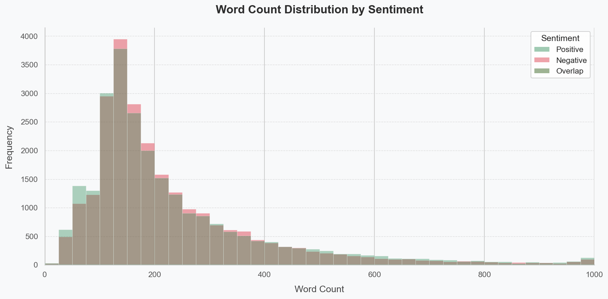
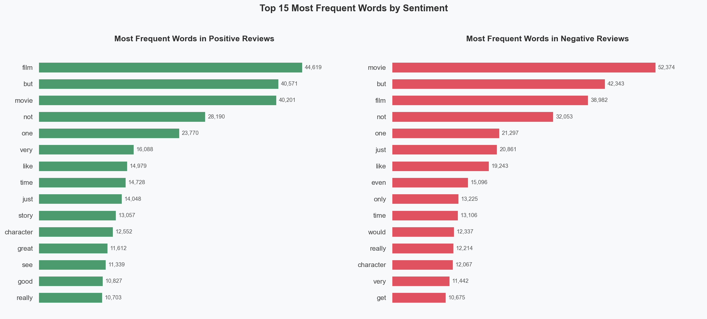
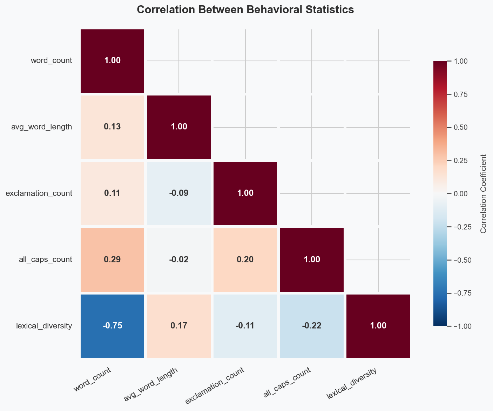
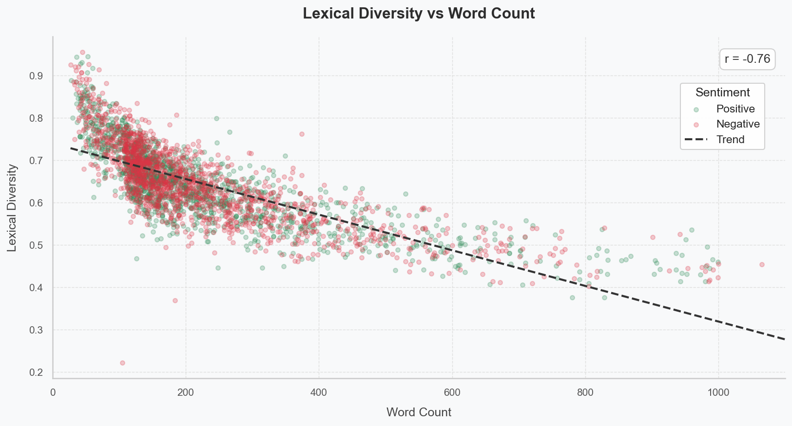
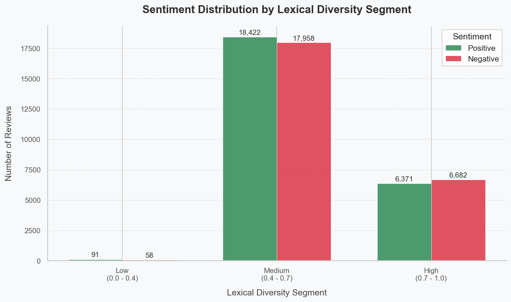

# IE 423 Term Project Proposal — Sentiment Analysis of IMDB Movie Reviews Using NLP and Machine Learning

## Team Information

- Bersu Yılmaz — 123203069
- Emirhan Karaca — 122203009
- Mert Ada Demirbaş — 123203026

## Dataset Description

We use the **IMDB Dataset of 50K Movie Reviews**, obtained from [Kaggle](https://www.kaggle.com/datasets/lakshmi25npathi/imdb-dataset-of-50k-movie-reviews). The dataset contains 50,000 movie reviews labeled for binary sentiment classification (positive and negative), providing a balanced corpus for text analysis and machine learning experiments.

Analyzing the relationship between document length and sentiment is an important step in exploratory data analysis and feature engineering. This study examines whether word count has predictive value, and whether variations in review length introduce bias in classification models — for example, by associating longer texts with negative sentiment. The IMDB dataset is a suitable base for this analysis because it lets us evaluate whether review length should be used as a feature to improve model performance or normalized to reduce potential bias.

## Dataset Access and Location

The raw dataset is expected at:

```
data/raw/IMDB Dataset.csv
```

If the file is missing, download it from Kaggle:

https://www.kaggle.com/datasets/lakshmi25npathi/imdb-dataset-of-50k-movie-reviews

and place it inside `data/raw/`. Full instructions are in [`data/README.md`](../data/README.md).

## Research Questions

### Research Question 1
**Can traditional machine learning algorithms reliably and interpretably classify customer sentiment to support initial quality control in feedback loops?**

**Explanation:**
In large-scale customer feedback systems, quickly distinguishing positive from negative opinions is crucial for effective decision-making and prioritization. This study examines whether traditional machine learning models — valued for their simplicity and transparency — can serve as practical tools for automating early-stage quality control through binary sentiment classification. Unlike complex deep learning approaches, models such as Logistic Regression, Naive Bayes, and Support Vector Machines offer interpretable decision processes, making them suitable candidates for real-world deployment where accountability and explainability are required. The IMDB 50K dataset provides a suitable test environment, as it includes diverse reviews with varying linguistic complexity, enabling a realistic assessment of whether interpretable models are sufficient for accurate and reliable sentiment classification.

### Research Question 2
**Is there a statistically significant correlation between review length (word count) and sentiment polarity, indicating whether dissatisfied viewers write more exhaustive reviews?**

**Explanation:**
Analyzing the relationship between document length and class labels is a fundamental step in exploratory data analysis and feature engineering. This question investigates whether simple structural metadata (word count) holds predictive power for the target variable (sentiment), and whether varying text lengths introduce a distribution bias that could cause classification models to essentially associate verbosity with the negative class. The IMDB dataset is ideal for evaluating this dynamic; its 50,000 labeled reviews provide the necessary volume to test if document length should be utilized as an engineered feature to improve model accuracy, or if length normalization is required to prevent algorithmic bias.

### Research Question 3
**Are misclassified reviews concentrated in specific structural or behavioral patterns, such as review length, use of rare words, or emotionally mixed content?**

**Explanation:**
Systematic error analysis is essential in the machine learning lifecycle, as it helps identify model weaknesses beyond overall accuracy. By examining misclassified reviews, this study explores how traditional models handle complex text structures, including rare words and emotionally mixed content. The IMDB dataset provides a suitable setting due to its diverse vocabulary and varying review lengths, allowing clear identification of False Positives and False Negatives. Analyzing these errors will help reveal patterns that negatively affect model performance and guide future improvements.

## Project Proposal

The primary objective of this project is to evaluate the effectiveness of traditional machine learning methods in sentiment analysis, with a focus on interpretable binary sentiment classification and understanding factors that influence model performance.

The study begins with data preprocessing — text cleaning, normalization, and transformation into numerical representations such as Bag-of-Words and TF-IDF. This is followed by exploratory data analysis to examine sentiment distribution, review length patterns, and potential relationships between textual features and sentiment polarity.

In line with the research questions, models such as Logistic Regression, Naive Bayes, and Support Vector Machines may be implemented. Statistical analyses will evaluate the relationship between review length and sentiment, alongside error analysis to identify patterns in misclassified reviews.

The project aims not only to achieve reliable classification performance but also to generate interpretable insights, particularly regarding the usability of simpler models for detecting extreme sentiments in practical applications. Potential challenges include high-dimensional text data, bias related to review length, and difficulties in handling ambiguous or mixed sentiments.

## Preprocessing Steps

### Step 1 — Loading the Data
The initial data pipeline is executed by `scripts/01_load_data.py`. It ingests the raw IMDB dataset via pandas to establish the baseline dataframe, which contains 50,000 observations with two primary columns (`review` and `sentiment`).

### Step 2 — Initial Inspection
The same script verifies dataset integrity: there are no missing values, exact duplicate rows are flagged for downstream removal, and the class distribution is confirmed to be perfectly balanced (50% positive, 50% negative).

### Step 3 — Cleaning
`scripts/02_preprocess_data.py` performs the full normalization and feature engineering sequence:

- **Deduplication & label encoding.** Exact duplicate rows are dropped to prevent data leakage; sentiment labels are mapped to a binary format (`positive` → 1, `negative` → 0).
- **Pre-cleaning feature extraction.** Raw emotional indicators (`exclamation_count`, `all_caps_count`) are computed directly from the untouched strings, before lowercasing and punctuation removal could erase those signals.
- **Text normalization & negation handling.** HTML tags and punctuation are stripped, text is lowercased, and a custom 3-word negation window prefixes tokens following negation triggers with `NEG_`. Standard stop-words are removed (excluding negation-relevant words), and WordNet lemmatization produces the final `cleaned_review` column.
- **Post-cleaning metrics & integrity.** `word_count`, `avg_word_length`, and `lexical_diversity` are computed on the raw text to capture true semantic length. Rows that become empty after cleaning are dropped.

### Step 4 — Saving Processed Data
The engineered dataframe is exported to `data/processed/cleaned_data_set.csv` with 8 columns: the original review, the cleaned review, the binary label, and the five custom statistical features. This file is the static input for EDA and modeling.

## Initial Outputs

### Dataset Shape
After loading and removing duplicates, the dataset contains **49,582 reviews** and **8 columns** (`review`, `cleaned_review`, `sentiment`, `word_count`, `avg_word_length`, `lexical_diversity`, `exclamation_count`, `all_caps_count`).

### Missing Value Summary
No missing values are detected in any column after preprocessing. All 49,582 rows are complete and ready for analysis.

### Descriptive Statistics
Generated by `scripts/03_basic_eda.py` and saved to `outputs/tables/descriptive_stats.csv`.

|       | word_count | avg_word_length | exclamation_count | all_caps_count | lexical_diversity |
|-------|-----------:|----------------:|------------------:|---------------:|------------------:|
| count | 49,582 | 49,582 | 49,582 | 49,582 | 49,582 |
| mean  | 229.06 | 4.31 | 0.98 | 1.72 | 0.645 |
| std   | 169.79 | 0.30 | 2.92 | 4.11 | 0.094 |
| min   | 4 | 3.04 | 0 | 0 | 0.042 |
| 25%   | 125 | 4.10 | 0 | 0 | 0.583 |
| 50%   | 172 | 4.29 | 0 | 1 | 0.645 |
| 75%   | 278 | 4.49 | 1 | 2 | 0.704 |
| max   | 2,459 | 12.24 | 282 | 154 | 1.000 |

### Summary Statistics by Sentiment
Generated by `scripts/03_basic_eda.py` and saved to `outputs/tables/summary_stats_by_sentiment.csv`.

|                       | word_count | avg_word_length | exclamation_count | all_caps_count | lexical_diversity |
|-----------------------|-----------:|----------------:|------------------:|---------------:|------------------:|
| Negative — Mean       | 227.24 | 4.28 | 1.03 | 1.88 | 0.647 |
| Negative — Median     | 173.00 | 4.27 | 0.00 | 1.00 | 0.648 |
| Positive — Mean       | 230.86 | 4.34 | 0.93 | 1.56 | 0.642 |
| Positive — Median     | 171.00 | 4.33 | 0.00 | 0.00 | 0.642 |

### Example Visualizations
All figures below are generated by `scripts/03_basic_eda.py` and saved under `outputs/figures/`.













## Reproducibility Instructions

### 1. Clone the repository
```bash
git clone https://github.com/BILGI-IE-423/ie423-2025-2026-termproject-hungrymachines_42
cd ie423-2025-2026-termproject-hungrymachines_42
```

### 2. Install required packages
```bash
pip install -r requirements.txt
```

### 3. Place the raw dataset
Download `IMDB Dataset.csv` from Kaggle:

https://www.kaggle.com/datasets/lakshmi25npathi/imdb-dataset-of-50k-movie-reviews

and place it at exactly:

```
data/raw/IMDB Dataset.csv
```

### 4. Run the scripts (from the repository root)
```bash
python scripts/01_load_data.py
python scripts/02_preprocess_data.py
python scripts/03_basic_eda.py
```

After step 4, the cleaned dataset will be at `data/processed/cleaned_data_set.csv`, all figures will be in `outputs/figures/`, and all tables will be in `outputs/tables/`.

## Transparency and Traceability

All outputs presented in this document are generated directly from the Python scripts in `scripts/`. No result is produced or modified outside of those scripts. The pipeline is designed so that anyone can clone the repository, install the required packages, place the raw CSV, and regenerate every output by running the three scripts in order.

### Script Responsibilities

| Script | Responsibility |
|---|---|
| `01_load_data.py` | Loads the raw IMDB dataset, validates the file path, and prints basic structural info |
| `02_preprocess_data.py` | Removes duplicates, applies text cleaning with negation tagging (`NEG_`) and lemmatization, computes statistical features, encodes sentiment, and saves the processed dataset |
| `03_basic_eda.py` | Generates all summary statistics tables and visualizations from the cleaned dataset |

### Output Locations

| Output | Path |
|---|---|
| Cleaned dataset | `data/processed/cleaned_data_set.csv` |
| Summary statistics by sentiment | `outputs/tables/summary_stats_by_sentiment.csv` |
| Descriptive statistics | `outputs/tables/descriptive_stats.csv` |
| Six figures | `outputs/figures/*.png` |

### Reproducibility Note
The scatter-plot sampling step in `03_basic_eda.py` uses `random_state=42`, so the same plot is produced on every run. The negation tagging system (`NEG_` prefix) is implemented in `02_preprocess_data.py` and is the only place where token order interacts with sentiment information.
