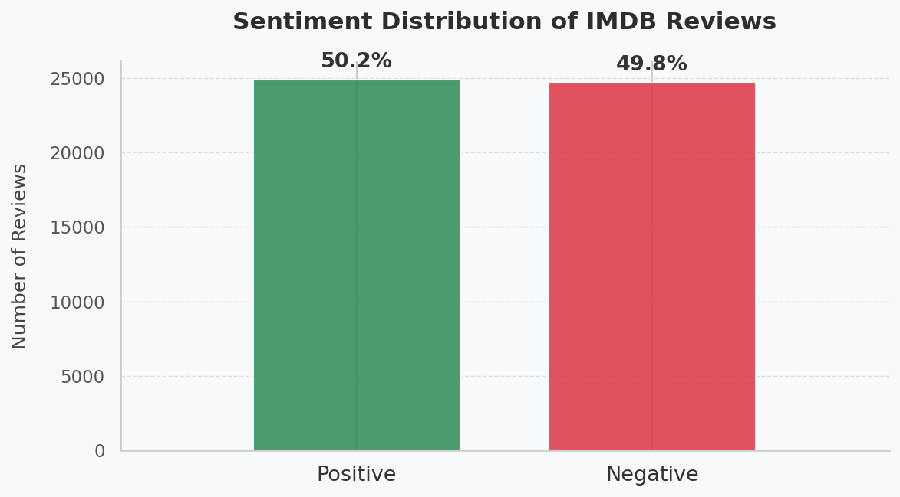
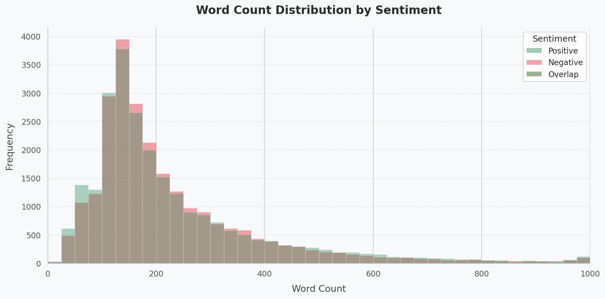
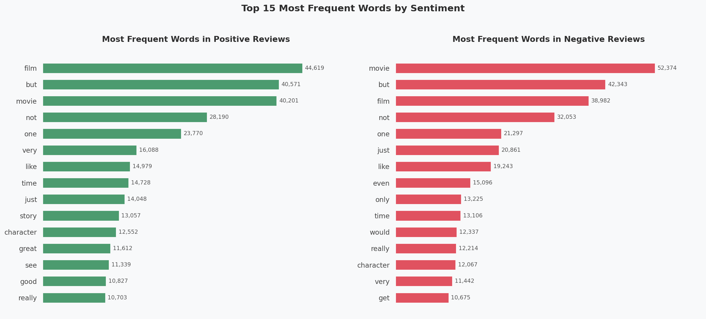
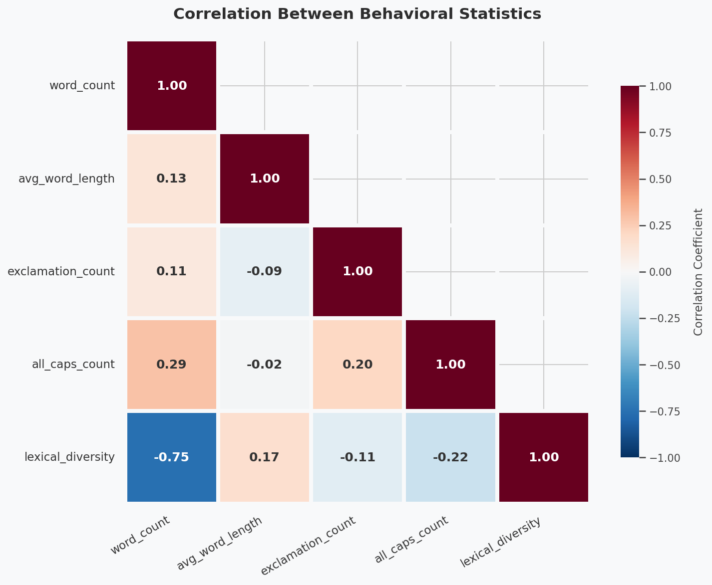
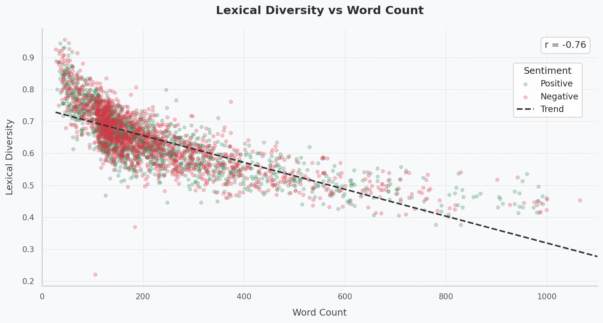
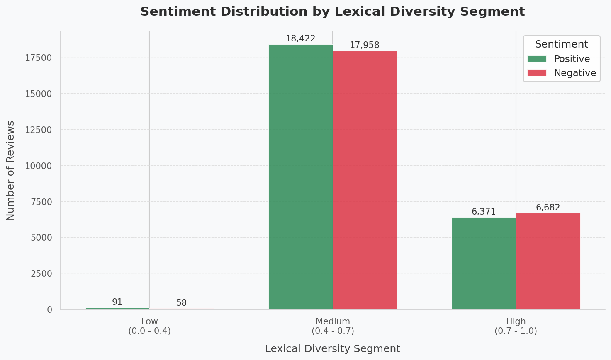

# IE 423 Term Project Proposal

## Team Information

* Bersu Yılmaz - 123203069

* Emirhan Karaca - 122203009

* Mert Ada Demirbaş - 123203026
  

## Dataset Description

We use the IMDB Dataset of 50K Movie Reviews, obtained from [Kaggle](https://www.kaggle.com/datasets/lakshmi25npathi/imdb-dataset-of-50k-movie-reviews).

This dataset contains 50,000 movie reviews labeled for binary sentiment classification (positive and negative), providing a balanced dataset for text analysis and machine learning applications.

Analyzing the relationship between document length and sentiment is an important step in exploratory data analysis and feature engineering. This study examines whether word count has predictive value and whether variations in review length introduce bias in classification models, potentially associating longer texts with negative sentiment.

The IMDB dataset provides a suitable basis for this analysis, enabling us to evaluate whether review length should be used as a feature to improve model performance or normalized to reduce potential bias.


## Dataset Access and Location
The dataset is stored in: `data/raw/IMDB Dataset.csv`

If the dataset needs to be downloaded manually, it is available at:

https://www.kaggle.com/datasets/lakshmi25npathi/imdb-dataset-of-50k-movie-reviews

After downloading, place the file inside:

`data/raw/`

## Research Questions

### Research Question 1 
Can traditional machine learning algorithms reliably categorize extreme sentiments to automate initial quality control in customer feedback loops?

**Explanation:** 
In large-scale customer feedback systems, quickly identifying strongly positive or negative opinions is crucial for effective decision-making and prioritization. This study examines whether traditional machine learning models can serve as practical tools for automating early-stage quality control by focusing on extreme sentiment detection. The key objective is to evaluate whether simpler and more interpretable models are sufficient for identifying highly polarized feedback in real-world scenarios. The IMDB 50K dataset provides a suitable test environment, as it includes diverse reviews with varying emotional intensity, enabling a realistic assessment of model performance.

### Research Question 2
Is there a statistically significant correlation between the review length (word count) and the sentiment polarity, indicating whether dissatisfied viewers write more exhaustive reviews?

**Explanation:**
Analyzing the relationship between document length and class labels is a fundamental step in exploratory data analysis (EDA) and feature engineering. This inquiry investigates whether simple structural metadata (word count) holds predictive power for the target variable (sentiment), and whether varying text lengths introduce a distribution bias that could cause classification models to essentially associate verbosity with the negative class. The IMDB dataset is ideal for evaluating this dynamic; its 50,000 labeled reviews provide the necessary volume to test if document length should be utilized as an engineered feature to improve model accuracy, or if length normalization is required to prevent algorithmic bias.

### Research Question 3
Are misclassified reviews concentrated in specific structural or behavioral patterns, such as review length, use of rare words, or emotionally mixed content?

**Explanation:**
Systematic error analysis is essential in the machine learning lifecycle, as it helps identify model weaknesses beyond overall accuracy. By examining misclassified reviews, this study explores how traditional models handle complex text structures, including rare words and emotionally mixed content. The IMDB dataset provides a suitable setting due to its diverse vocabulary and varying review lengths, allowing clear identification of False Positives and False Negatives. Analyzing these errors will help reveal patterns that negatively affect model performance and guide future improvements.

## Project Proposal
The primary objective of this project is to evaluate the effectiveness of traditional machine learning methods in sentiment analysis, with a focus on detecting extreme opinions and understanding factors that influence model performance.

The study will begin with data preprocessing, including text cleaning, normalization, and transformation into numerical representations such as Bag-of-Words and TF-IDF. This will be followed by exploratory data analysis to examine sentiment distribution, review length patterns, and potential relationships between textual features and sentiment polarity.

In line with the research questions, models such as Logistic Regression, Naive Bayes, and Support Vector Machines which may be implemented. Additionally, statistical analyses will be conducted to evaluate the relationship between review length and sentiment, alongside error analysis to identify patterns in misclassified reviews.

The project aims not only to achieve reliable classification performance but also to generate interpretable insights, particularly regarding the usability of simpler models for detecting extreme sentiments in practical applications.

Potential challenges include high-dimensional text data, bias related to review length, and difficulties in handling ambiguous or mixed sentiments.

## Preprocessing Steps 

### Step 1 - Loading the Data 
The initial data pipeline was executed using `scripts/01_load_data.py` . We ingested the raw IMDB dataset via pandas to establish our baseline dataframe, which comprised exactly 50,000 observations with two primary columns (`review` and `sentiment`), preparing it for subsequent structural analysis.

### Step 2 - Initial Inspection
We performed a basic structural analysis using the same data-loading script (`scripts/01_load_data.py`). During this phase, we verified the total absence of missing values, flagged existing duplicate entries, and confirmed a perfectly balanced class distribution (50% positive and 50% negative reviews). This step was necessary to validate data integrity before any complex manipulation.

### Step 3 - Cleaning 
Utilizing `scripts/02_preprocess_data.py`, we executed a strict normalization and feature engineering sequence to finalize the dataset:

- **Deduplication & Encoding:** Exact duplicate rows were dropped to prevent data leakage, and target labels were converted to a machine-readable binary format (`positive` -> 1, `negative` -> 0).

- **Pre-cleaning Feature Extraction:** We extracted raw emotional indicators (`exclamation_count` and `all_caps_count`) directly from the untouched strings. Extracting them beforehand preserved critical typographic signals that standard NLP cleaning would otherwise destroy.

- **Text Normalization & Negation Handling:** We stripped HTML/punctuation noise and lowercased the text. To prevent our future models from misinterpreting inverted sentiments, we implemented a custom 3-word negation window, prefixing words following negation triggers with a `NEG_` tag. We then removed standard stop-words and applied WordNet Lemmatization to produce the `cleaned_review` column.

- **Post-cleaning Metrics & Integrity:** Finally, we calculated `word_count`, `avg_word_length`, and `lexical_diversity` from the cleaned text to capture true semantic length. Any rows that became completely empty due to the cleaning process were systematically dropped.

### Step 4 - Saving Processed Data 
The fully engineered dataframe was exported as `data/processed/cleaned_data_set.csv`. This final dataset consists of 8 columns: the original text, the cleaned text, the binary label, and our five custom statistical features. This output serves as the definitive, static dataset ready for Exploratory Data Analysis and Model Training.


## Initial Outputs

### Dataset Shape
After loading and removing duplicate rows, the dataset contains **49,582 reviews** and **8 columns**
(`review`, `cleaned_review`, `sentiment`, `word_count`, `avg_word_length`, `lexical_diversity`, `exclamation_count`, `all_caps_count`).

### Missing Value Summary
No missing values were detected in any column after preprocessing.  
All 49,582 rows are complete and ready for analysis.

### Descriptive Statistics
The table below was generated by `scripts/03_basic_eda.py` and saved as `descriptive_stats.csv`.

| | word_count | avg_word_length | exclamation_count | all_caps_count | lexical_diversity |
|---|---|---|---|---|---|
| count | 49,582 | 49,582 | 49,582 | 49,582 | 49,582 |
| mean | 229.06 | 4.31 | 0.98 | 1.72 | 0.645 |
| std | 169.79 | 0.30 | 2.92 | 4.11 | 0.094 |
| min | 4 | 3.04 | 0 | 0 | 0.042 |
| 25% | 125 | 4.10 | 0 | 0 | 0.583 |
| 50% | 172 | 4.29 | 0 | 1 | 0.645 |
| 75% | 278 | 4.49 | 1 | 2 | 0.704 |
| max | 2,459 | 12.24 | 282 | 154 | 1.000 |

### Summary Statistics by Sentiment
The table below was generated by `scripts/03_basic_eda.py` and saved as `summary_stats_by_sentiment.csv`.

| | word_count | avg_word_length | exclamation_count | all_caps_count | lexical_diversity |
|---|---|---|---|---|---|
| Negative — Mean | 227.24 | 4.28 | 1.03 | 1.88 | 0.647 |
| Negative — Median | 173.00 | 4.27 | 0.00 | 1.00 | 0.648 |
| Positive — Mean | 230.86 | 4.34 | 0.93 | 1.56 | 0.642 |
| Positive — Median | 171.00 | 4.33 | 0.00 | 0.00 | 0.642 |

### Example Visualizations
The figures below were generated by `scripts/03_basic_eda.py`.













## Reproducibility Instructions

### 1. Clone the repository
```bash
git clone https://github.com/BILGI-IE-423/ie423-2025-2026-termproject-hungrymachines_42
cd ie423-2025-2026-termproject-hungrymachines_42
```

### 2. Install required packages
```text
pip install -r requirements.txt
```

### 3. Place the dataset

Download the dataset from:

https://www.kaggle.com/datasets/lakshmi25npathi/imdb-dataset-of-50k-movie-reviews

Put the dataset file inside:
```text
data/raw/
```


### 4. Run the scripts
```text
python scripts/01_load_data.py
python scripts/02_preprocess_data.py
python scripts/03_basic_eda.py
```

```
## Transparency and Traceability

All outputs presented in this repository are generated directly from the Python scripts located in the `scripts/` folder. No results were manually created or modified outside of these scripts.

The pipeline is designed to be fully reproducible — any user can clone the repository, install the required packages, and re-generate all outputs by running the three scripts in order.

### Script Responsibilities

| Script | Responsibility |
|---|---|
| `01_load_data.py` | Loads the raw IMDB dataset, removes duplicates, and performs initial validation |
| `02_preprocess_data.py` | Applies text cleaning, negation tagging (NEG_), lemmatization, feature engineering, and sentiment encoding |
| `03_basic_eda.py` | Generates all summary statistics and visualizations from the cleaned dataset |

### Output Structure

| Output Type | Content |
|---|---|
| `cleaned_data_set.csv` | Fully preprocessed dataset with engineered features, used as input for EDA and modeling |
| `summary_stats_by_sentiment.csv` | Mean and median statistics grouped by sentiment label |
| `descriptive_stats.csv` | Descriptive statistics for all behavioral features |
| `*.png` (6 figures) | All visualizations produced by `03_basic_eda.py` |

### Reproducibility Note

All random operations (e.g., scatter plot sampling) use a fixed seed (`random_state=42`) to ensure consistent outputs across runs. The preprocessing pipeline preserves negation context through a custom NEG_ tagging system, which is documented in `02_preprocess_data.py`.


